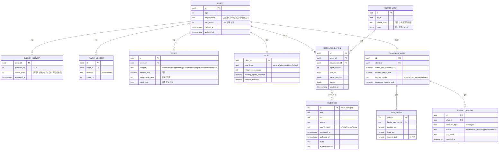
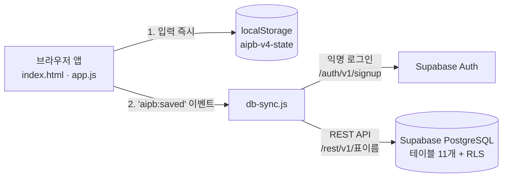

# DB 설계

> 교수님 진행 순서의 **4번째 산출물(DB 설계)** 초안입니다. 구현 가이드 5.4 "저장할 데이터"와 현재 v4 화면의 입력값을 기준으로 정리했습니다.
> 상태: **2단계(Supabase) 구현** (2026-10-07, 옥경환, 이슈 #20) — 실제 테이블 정의는 `supabase/schema.sql`, 앱 연결은 `db-sync.js`

## 1. 저장 방식 단계

| 단계 | 저장소 | 언제 | 근거 |
|---|---|---|---|
| 1단계 (현재) | 브라우저 `localStorage` 1개 키 (`aipb-v4-state`) | PR #7 | 로그인 없는 MVP. 한 브라우저 안에서만 유지 |
| 1단계 (현재) | `data/news.json` 파일 | GitHub Actions | 뉴스·지표는 모든 사용자가 같은 내용을 보므로 파일로 충분 |
| **2단계 (구현됨)** | Supabase(PostgreSQL, 서울 리전) + 자동 REST API | 이슈 #20 | 강의자료(IT 기초 05)에서 BaaS 예시로 제시. 강의계획서 8~9주차(백엔드·DB, REST API 연동) |

아래 테이블 설계는 **2단계(관계형 DB)를 기준**으로 하고, 1단계 localStorage는 같은 구조를 JSON 하나로 묶어 저장합니다.

## 2. ERD



## 3. 테이블 설명

| 테이블 | 무엇을 저장 | 화면 | 왜 필요한가 (가이드 5.4) |
|---|---|---|---|
| CLIENT | 연령, 현재 상태, 산출 성향 | 1 고객 정보 | 목표와 적합성의 기준 |
| SURVEY_ANSWER | 설문 10문항에서 고른 선택지 번호 | 1 고객 정보 | 성향 산출 근거 보존 (적합성 원칙 확인 기록) |
| FAMILY_MEMBER | 배우자·자녀 | 1 고객 정보 | 승계 사전진단에서 재사용 |
| GOAL | 목표 유형, 은퇴 시점·생활비·연금 | 2 목표 설계 | 조건부 경로와 은퇴 버킷 |
| ASSET | 자산 종류·금액, 사모펀드 환매 연도, 반드시 보유 | 3 자산 입력·진단 | 통합 자산 진단 |
| TRANSFER_PLAN / HEIR_SHARE | 상속세 추정, 재원 방식, 희망 배분·법정상속분·유류분 | 4 승계 사전진단 | 위험 신호와 전문가 검토 |
| HOUSE_VIEW | 기관 합의 하우스뷰 (+1/0/-1) | 5 하우스뷰 | 추천안의 기준 기록 (DECISIONS 2026-09-30) |
| RECOMMENDATION | 목표 배분, 거래 목록, TAA 반영 여부 | 6 설계·실행 | 결정 이력 보존 |
| EVIDENCE | 뉴스·지표 근거 | 5 하우스뷰, 뉴스 분석 | AI 판단의 추적 가능성 |
| EXPERT_REVIEW | 검토자, 상태, 승인 조건 | 8 전문가 검토 | 승인 전후 구분 |

## 4. 설계 원칙

- **금액 단위 통일**: 자산은 억원(`numeric`), 생활비·연금은 만원. 화면 입력 단위와 같게 둔다.
- **설문 원응답 보존**: 성향이나 점수가 아니라 **고른 선택지 번호**를 남긴다. 채점표(배점·구간)가 바뀌어도 다시 계산할 수 있다.
- **추천안은 덮어쓰지 않고 쌓는다**: `RECOMMENDATION`은 새 행으로 추가. 어떤 입력·하우스뷰·근거로 나왔는지 추적한다.
- **개인 식별정보는 받지 않는다**: 이름·주민번호·계좌번호 없음. `CLIENT.id`는 무작위 UUID.
- **전문가 승인은 별도 테이블**: 승인 전후를 구분하고, 승인 조건이 최종 리포트에 반영됐는지 확인한다.

## 5. 1단계(localStorage)와의 대응

| localStorage 필드 (`aipb-v4-state`) | 대응 테이블 |
|---|---|
| `fields.age`, `fields.employment` | CLIENT |
| `state.answers` | SURVEY_ANSWER |
| `state.spouse`, `state.children` | FAMILY_MEMBER |
| `state.goal`, `fields.retirement-years`, `fields.monthly-spend`, `fields.pension-income` | GOAL |
| `fields.asset-*`, `fields.pef-year`, `fields.lock-home` | ASSET |
| `fields.liquidity-target`(상속세 재원 목표), `fields.insurance-reserve` | TRANSFER_PLAN |
| `fields.lock-pef`(사모펀드 조정 불가), `fields.gift-window`(5년 내 증여 예정) | ASSET, TRANSFER_PLAN |
| `state.heirShares`, `state.estateMode`, `state.estateTarget`, `state.estateTargetManual`(목표를 직접 고쳤는지) | TRANSFER_PLAN, HEIR_SHARE |
| `state.useTaa`, `state.useBand`, `fields.band-switch` | RECOMMENDATION |
| `state.currentView`, `state.returnView`, `state.surveyIndex` | (화면 위치 — DB에는 저장 안 함) |
| (저장 안 함) 전문가 승인 | EXPERT_REVIEW |

## 6. 실제 구현 (Supabase)

### 6-1. 구조



- 앱은 지금처럼 **localStorage에 먼저 저장**합니다. `db-sync.js`가 같은 내용을 2초 모았다가 Supabase에 올립니다.
- **로그인 없음 → 익명 로그인**: 브라우저마다 고유 사용자(`auth.uid()`)를 받고, `client.owner`로 묶습니다.
- **접근 규칙(RLS)**: 내 고객 행과 그 하위 행만 읽고 쓸 수 있습니다. 하우스뷰·근거는 누구나 읽기만 가능합니다. 추천안은 추가·읽기만 가능하고 수정·삭제는 막혀 있습니다.
- **장애 시**: 네트워크가 끊기거나 Supabase가 응답하지 않으면 서버 저장만 건너뛰고, 앱은 localStorage로 그대로 동작합니다.
- 앱에 들어 있는 키는 웹에 공개해도 되는 **publishable 키**입니다. 비밀 키는 저장소에 없습니다.

### 6-2. 화면 → 테이블 저장 시점

| 테이블 | 언제 저장 | 방식 |
|---|---|---|
| client | 입력이 바뀔 때마다 | 연령·현재 상태·성향(설문 10문항을 다 답했을 때만) 갱신 |
| survey_answer | 설문에 답할 때 | (고객, 문항 번호) 기준 덮어쓰기 |
| family_member | 배우자·자녀 수가 바뀔 때 | 수에 맞게 행 추가·삭제 |
| goal | 목표·은퇴 입력이 바뀔 때 | 고객 기준 덮어쓰기 |
| asset | 자산 금액이 바뀔 때 | (고객, 자산군) 기준 덮어쓰기, 9개 자산군 |
| transfer_plan | 승계가 포함된 목표일 때 | 고객 기준 덮어쓰기 |
| recommendation | **최종 리포트 화면에 도착했고 목표 배분이 지난번과 다를 때** | 새 행으로 쌓음(이력 보존) |
| heir_share, expert_review, house_view, evidence | 아직 앱에서 쓰지 않음 | 하우스뷰·근거는 관리자가 대시보드에서 입력 예정 |

### 6-3. REST API 사용 예시

```http
# 1) 익명 로그인 → access_token 받기
POST https://ozetifxlmlvfwnuqytqg.supabase.co/auth/v1/signup
apikey: <publishable 키>
{"data": {}}

# 2) 내 자산 읽기
GET /rest/v1/asset?select=category,amount_eok
apikey: <publishable 키>
Authorization: Bearer <access_token>

# 3) 자산 저장(있으면 덮어쓰기)
POST /rest/v1/asset?on_conflict=client_id,category
Prefer: resolution=merge-duplicates
[{"client_id": "...", "category": "govbond", "amount_eok": 3}]
```

### 6-4. 검증 (2026-10-07)

| 시험 | 결과 |
|---|---|
| 익명 로그인 → 고객·자산 저장 → 내 데이터 읽기 | 성공 |
| 다른 익명 사용자가 내 고객 읽기 | 0건 (안 보임) |
| 다른 익명 사용자가 내 고객에 자산 쓰기 | 403 거부 |
| 로그인 없이 고객 테이블 읽기 | 401 거부 |
| 앱에서 설문·자산 입력 후 리포트 도착 | 7개 테이블에 저장 확인 (설문 10, 가족 3, 자산 9, 추천안 1) |
| 자녀 2 → 1명 | 가족 행도 1명으로 줄어듦 |
| Supabase 연결 실패 상황 | 서버 저장만 건너뛰고 localStorage 저장·화면은 정상 |

## 7. 남은 일

- [x] 2단계(Supabase)로 감 (2026-10-07, 이슈 #20)
- [ ] 하우스뷰 합의에 참여할 증권사 목록 (DECISIONS 2026-09-30)
- [x] 설문 점수 구간을 표준 예시 환산값(≤19/≤28/≤36/≤45)으로 교체 (`fix/assumptions`)
