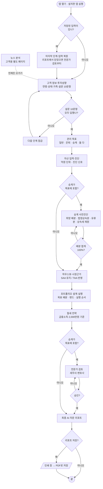
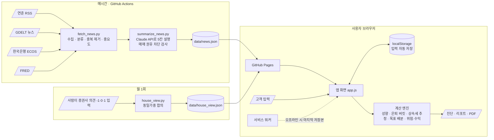

# 플로우차트 (구현 기준 최신판)

> 교수님 진행 순서 **3번째 산출물(플로우차트)** 을 현재 구현(v4 + 이번 PR들)에 맞춰 다시 그린 판입니다. 2026-10-04, 옥경환.
> 처음 제출한 플로우차트는 React·FastAPI·Supabase를 가정했지만, 구현 가이드 개정(2026-10-02, DECISIONS)으로 **정적 웹앱(GitHub Pages) + GitHub Actions** 구조로 바뀌어 이 판으로 대체합니다. 화면별 상세는 `SCREEN_SCENARIO.md`.

## 1. 사용자 흐름도 — 화면 이동

- 일반·은퇴 목표: 7단계 / 승계 포함: 9단계 (`getFlow()`)
- 모든 입력은 0.3초 뒤 브라우저에 자동 저장

## 2. 처리 흐름도 — 데이터와 계산

### 설계 포인트

- **숫자는 계산 엔진, 설명은 AI**: AI는 5칸 설명만 쓰고 비중·매매 숫자는 정하지 않음. 계산 공식은 `FUNCTIONS.md`, 손계산 재현은 `CALC_EXAMPLES.md`
- **서버 없이 동작**: 정적 호스팅이라 수집·AI 설명은 GitHub Actions에서, API 키는 Actions Secrets에만
- **승계는 사전진단까지**: 상속세는 추정치, 법률 판단은 전문가 검토 후 확정
- **개인 식별정보를 받지 않음**: 이름·주민번호·계좌번호 없음, 입력은 사용자 브라우저에만 저장
