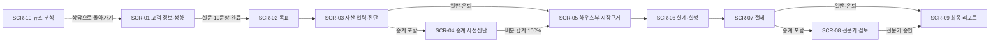

# 화면 시나리오 (화면 정의서)

> 교수님 진행 순서 **2번째 산출물(화면 시나리오)** 을 v4 프로토타입 실제 화면 기준으로 정리한 문서입니다. 이미 제출한 시나리오가 있다면 이 문서는 **구현과 1:1로 맞춘 최신판**으로 씁니다.
> 상태: 초안 (2026-10-04, 옥경환). 화면 그림은 `docs/images/guide/`, 사용자용 설명은 `docs/USER_GUIDE.md`, 계산식은 `docs/FUNCTIONS.md`.

## 0. 화면 목록과 흐름

| ID | 화면 (`data-view-panel`) | 사용자 | 일반·은퇴 경로 | 승계 포함 경로 |
|---|---|---|---|---|
| SCR-01 | 고객 정보·투자성향 (`profile`) | PB·고객 | 1 | 1 |
| SCR-02 | 관리 목표 선택 (`goals`) | PB·고객 | 2 | 2 |
| SCR-03 | 자산 입력·진단 (`dashboard`) | PB | 3 | 3 |
| SCR-03a | 자산 세부내역 (`assets`) | PB | 3의 하위 | 3의 하위 |
| SCR-04 | 자산승계 사전진단 (`transfer`) | PB | — | 4 |
| SCR-05 | 하우스뷰·시장근거 (`market`) | PB | 4 | 5 |
| SCR-06 | 포트폴리오 설계·실행 (`analysis`) | PB | 5 | 6 |
| SCR-07 | 절세 전략 (`tax`) | PB | 6 | 7 |
| SCR-08 | 전문가 검토 (`experts`) | PB·세무사·변호사 | — | 8 |
| SCR-09 | 최종 AI 자문 리포트 (`report`) | PB·고객 | 7 | 9 |
| SCR-10 | 뉴스 분석 (`news`) | 고객(투자자) | 상담 흐름과 별도 | 상담 흐름과 별도 |

공통 요소: 왼쪽 메뉴(어느 화면으로든 이동), 상단 단계 표시(`n / 7` 또는 `n / 9`), 하단 이전·다음 버튼(잠금 조건 있으면 비활성), 자동 저장 표시, 오프라인 안내(PWA).

## 1. 화면별 정의

### SCR-01 고객 정보·투자성향
| 구분 | 내용 |
|---|---|
| 목적 | 적합성 원칙(금융소비자보호법 제17조)에 필요한 연령·상태·위험성향 확인. 식별정보(이름·주민번호·계좌)는 받지 않음 |
| 입력 | 연령 `#age`(숫자 18~100, 기본 62) · 현재 상태 `#employment`(근로소득자/사업자/은퇴 예정/은퇴) · 배우자 0~1명, 자녀 0~5명(−/＋) · 설문 10문항(한 문항씩, 이전/다음) |
| 처리 | `surveyScore()` → `getProfile()` = min(설문 성향, 손실감내 응답) |
| 출력 | 성향 5단계 카드(점수·손실 감내 수준) |
| 이동 | 다음: SCR-02 |
| 예외 | 설문 미완료 시 다음 버튼 잠금, 버튼 클릭 시 "투자성향 설문 10문항에 모두 답해주세요." |

### SCR-02 관리 목표 선택
| 구분 | 내용 |
|---|---|
| 목적 | 목표에 따라 이후 단계(조건부 경로)와 필수 안정자산을 정함 |
| 입력 | 목표 `goal`(일반/은퇴/승계/둘 다) · 은퇴 시 은퇴 시점(년 후), 월 생활비·연금(만원) |
| 처리 | `getFlow()`로 경로 결정, `retirementBuckets()`로 현금(2년치+비상 6개월)·채권(5년치) 버킷 |
| 출력 | 은퇴 현금흐름 카드, 승계 사전계획 카드, 경로 이름 |
| 이동 | 다음: SCR-03 |

### SCR-03 자산 입력·진단 / SCR-03a 세부내역
| 구분 | 내용 |
|---|---|
| 목적 | 금액은 이 화면에서 한 번만 받고 이후 모든 계산에 재사용 |
| 입력 | 부동산·국내 ETF·해외 ETF·국채·회사채·사모펀드·대체·현금·부채(억원, 0 이상, 0.1 단위) · 사모펀드 환매 가능 연도(2026~2045) · 거주 부동산 매각 금지 체크 |
| 처리 | `getAssets()`, `computePlan()` |
| 출력 | 총자산 구성, 진단 신호 최대 7개 — 조건에 맞는 것만 표시(안정자산 부족, 유휴현금, 적합성 초과, 사모펀드 부적합, 금융소득 종합과세, 부동산 집중) + 근거 연결(항상) — 각 신호를 누르면 관련 화면으로 |
| 이동 | 다음: 승계 포함 → SCR-04, 아니면 SCR-05 |

### SCR-04 자산승계 사전진단 (승계 포함 경로)
| 구분 | 내용 |
|---|---|
| 목적 | 희망 배분의 법적 위험 신호와 상속세 재원 계획. **확정이 아닌 사전진단** |
| 입력 | 가족별 희망 배분 %(0~100) · 상속세 재원 목표(억원) · 보험 등 별도 재원(억원) · 재원 방식 A 금융자산/B 종신보험 병행/C 연부연납 |
| 처리 | `buildHeirs()`(법정상속분·유류분), `analyzeDistribution()`(입력할 때마다), `estimateEstateTax()`, `estateReserve()` |
| 출력 | 법률 검토 우선순위 낮음/보통/높음, 유류분 미달자, 평가 불확실 자산, 현금화 제약 |
| 이동 | 다음: SCR-05 |
| 예외 | 배분 합계 ≠ 100% → "입력 확인 필요", 다음 버튼 잠금 |

### SCR-05 하우스뷰·시장근거
| 구분 | 내용 |
|---|---|
| 목적 | 장기 배분(SAA)을 유지할지, 하우스뷰 조정(TAA)을 반영할지 근거와 함께 결정 |
| 입력 | SAA 유지 / TAA 반영 선택, 근거 탭(상세 리포트·근거 뉴스·판단 기록) |
| 처리 | `computePlan()`의 TAA 단계(해외 주식 −2%p → 국채·현금) |
| 출력 | 자산군별 하우스뷰(확대·중립·축소), 근거별 사실/AI 해석/반대 근거/판단 변경 조건 |
| 이동 | 다음: SCR-06 |

### SCR-06 포트폴리오 설계·실행
| 구분 | 내용 |
|---|---|
| 목적 | 목표 배분과 실제 거래 계획 확정 |
| 입력 | 허용범위 밴드 스위치(0.3억원 미만 차이 거래 생략) |
| 처리 | `computePlan()` 3단계(필수 안정자산 → 조정 불가 자산 → 성향별 배분), `portfolioStats()` |
| 출력 | 목표 배분 막대, 위험·수익 변화, Core-Satellite(테마 ETF 20% 한도), 분할 실행 순서 |
| 이동 | "설계·실행안 검토 완료" → SCR-07 |

### SCR-07 절세 전략
| 구분 | 내용 |
|---|---|
| 목적 | 금융소득 종합과세(연 2,000만원) 관리 |
| 처리 | `financialIncome()` — 신규 국채는 저쿠폰 가정 |
| 출력 | 현재·목표안 금융소득 막대와 기준선, 절세 수단 우선순위 |
| 이동 | 다음: 승계 포함 → SCR-08, 아니면 SCR-09 |

### SCR-08 전문가 검토 (승계 포함 경로)
| 구분 | 내용 |
|---|---|
| 목적 | AI 사전진단을 세무사·변호사가 확인하는 단계(Human-in-the-loop) |
| 입력 | 변호사 검토 요청, 전문가 승인 데모 |
| 출력 | 4단계 진행(AI 사전진단 → 세무사 → 변호사 → 승인안 반영), 검토 패키지 |
| 이동 | 승인 후 SCR-09 |
| 예외 | 승인 전 다음 버튼 잠금. 승인은 저장하지 않음 → 리포트에서 닫았다 다시 열면 이 화면부터 |

### SCR-09 최종 AI 자문 리포트
| 구분 | 내용 |
|---|---|
| 목적 | 목표·적합성·하우스뷰·전문가 조건·최종 배분·사후관리를 한 장에 |
| 처리 | `renderReport()` |
| 출력 | 핵심 지표 4개, 최종 금융자산 배분, 안정자산 확보액, 사후관리 계획(분기 리뷰·±5%p 리밸런싱 등), 판단 추적 ID, 법적 고지 |
| 동작 | "리포트 저장" → 인쇄 창 → PDF로 저장(A4, 리포트만). 승계 경로에서 승인 전이면 "전문가 승인 전 초안" 표시 *(feat/report-print 적용 시)* |

### SCR-10 뉴스 분석 (투자자 페이지)
| 구분 | 내용 |
|---|---|
| 목적 | 고객이 직접 보는 쉬운 뉴스 해설. 상담 흐름과 분리 |
| 입력 | 분류 필터(전체·금리·환율·유가·ETF·반도체·지정학), "AI 해석·반대 근거 보기" 펼치기 *(news-view 적용 시)* |
| 처리 | `data/news.json` 읽기(매시간 GitHub Actions 갱신). 실패하면 기존 데모 카드 유지 |
| 출력 | 카드: 출처 유형(공식·시장·뉴스), 시각(한국시간), 제목, 수치, 확인된 사실, 내 자산 영향, AI 해석·반대 근거·변경 조건, 원문 링크, 출처 표기 |
| 이동 | "상담으로 돌아가기" → 들어오기 전 화면 |
| 예외 | AI 설명이 아직 없으면 "AI 설명 준비 중", 오프라인이면 마지막 저장본 |

## 2. 공통 규칙

| 규칙 | 내용 |
|---|---|
| 자동 저장 | 입력 0.3초 뒤 브라우저에 저장, 다시 열면 마지막 화면·입력 복원. "처음부터 다시"로 삭제 |
| 단위 | 자산 억원, 생활비·연금 만원 |
| AI 문장 표시 | 사실과 AI 해석을 분리, AI가 쓴 문장은 "AI 작성" 표시, 매매 지시·비중 숫자 없음 |
| 법적 고지 | 리포트·뉴스 화면 하단 고정 — 투자 권유 아님, 세액·법률 확정 아님 |
| 반응형 | 모바일 390px에서 가로 스크롤 없음(검증) |
