# AI PB 사용 설명서

> 교수님 진행 순서의 **6번째 산출물(사용 설명서)** 초안입니다. 화면은 v4 프로토타입 + 입력 저장(PR #7) + PWA + 리포트 PDF 저장 기준(2026-10-03 캡처, 데모 데이터). *(시안)* 표시는 팀이 채택하면 생기는 기능입니다.
> 상태: 초안 (2026-10-03, 옥경환 작성) — 디자인(이슈 #3) 반영 후 캡처를 다시 찍습니다.

## 1. 이 앱은 무엇인가요

은퇴·자산승계 같은 **고객 목표**에서 출발해, 투자성향·보유 자산·시장 근거를 연결해 포트폴리오 설계안을 만드는 **AI PB(프라이빗 뱅커) 상담 도구**입니다.

- AI는 **설명과 위험 신호**만 만들고, 비중 숫자는 정해진 계산식(`docs/FUNCTIONS.md`)으로 나옵니다.
- 상속·세금 결과는 **추정치**입니다. 확정은 세무사·변호사 검토 단계에서 합니다.
- **투자 권유가 아닙니다.** 화면의 하우스뷰·뉴스·수치는 현재 데모 데이터입니다.

## 2. 여는 방법과 설치

| 방법 | 순서 |
|---|---|
| 웹으로 열기 | https://koreanchubby.github.io/ai-pb/ |
| PC 설치 (Chrome·Edge) | 주소창 오른쪽 **설치 아이콘(⊕ 모니터 모양)** → 설치 |
| Android (Chrome) | 메뉴 ⋮ → **홈 화면에 추가** 또는 **앱 설치** |
| iPhone (Safari) | 공유 버튼 → **홈 화면에 추가** |

- 설치하면 주소창 없이 앱처럼 열리고, **인터넷이 끊겨도** 마지막으로 본 화면과 뉴스를 보여줍니다(상단에 "오프라인입니다" 안내).
- 온라인이면 항상 최신 화면을 불러옵니다. 앱 파일 구성이 바뀌는 업데이트 때는 상단에 "새 버전이 있습니다 · 새로고침"이 뜹니다.

## 3. 상담 흐름 한눈에

목표에 따라 단계 수가 달라집니다.

| 고른 목표 | 단계 |
|---|---|
| 일반 자산관리 / 은퇴 준비 | 고객 정보 → 목표 → 자산 입력·진단 → 하우스뷰 → 설계·실행 → 절세 → 최종 리포트 (**7단계**) |
| 자산승계 / 은퇴·승계 모두 | 위 단계에 **승계 사전진단**(자산 진단 뒤)과 **전문가 검토**(절세 뒤) 추가 (**9단계**) |

화면 아래 **이전 단계 / 다음 단계** 버튼으로 이동합니다. 필요한 입력이 빠지면 다음 단계 버튼이 잠깁니다(설문 미완료, 희망 배분 합계 ≠ 100%, 전문가 승인 전). PC에서는 버튼에 마우스를 올리면 이유가 보입니다.

## 4. 단계별 사용법

### ① 고객 정보·투자성향

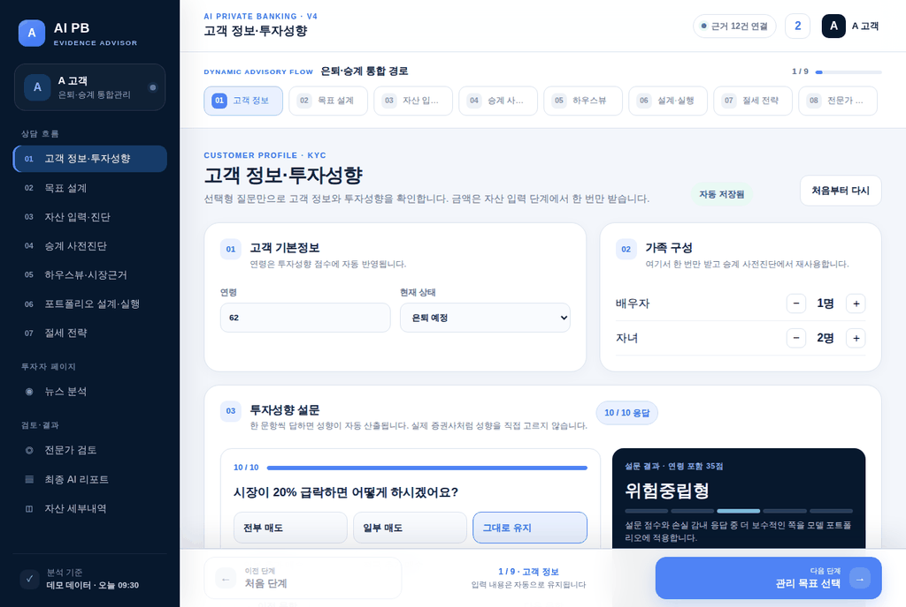

1. **연령**과 **현재 상태**(근로소득자·사업자·은퇴 예정·은퇴)를 고릅니다.
2. **가족 구성**: 배우자·자녀 수를 −/＋로 입력합니다. 승계 진단에서 다시 씁니다.
3. **투자성향 설문 10문항**에 답합니다. 10문항을 모두 답해야 다음으로 넘어갑니다.
4. 오른쪽에 성향(안정형~공격투자형 5단계)이 나옵니다. 설문 점수와 "감내 가능한 손실" 답 중 **더 보수적인 쪽**으로 정해집니다.

이름·주민번호·계좌번호는 받지 않습니다.

### ② 관리 목표 선택

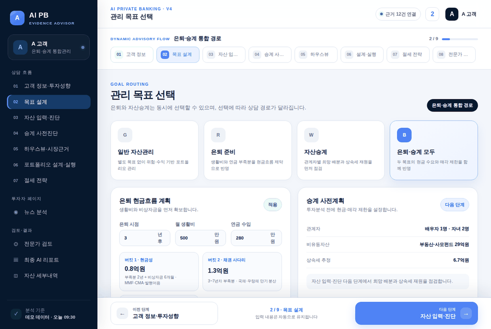

- **일반 자산관리 / 은퇴 준비 / 자산승계 / 은퇴·승계 모두** 중 하나를 고릅니다.
- 은퇴가 포함되면 **은퇴 시점, 월 생활비, 연금 수입(만원)** 을 넣습니다. 부족액으로 현금 버킷(2년치+비상자금)과 채권 버킷(5년치)이 계산됩니다.

### ③ 자산 입력·진단

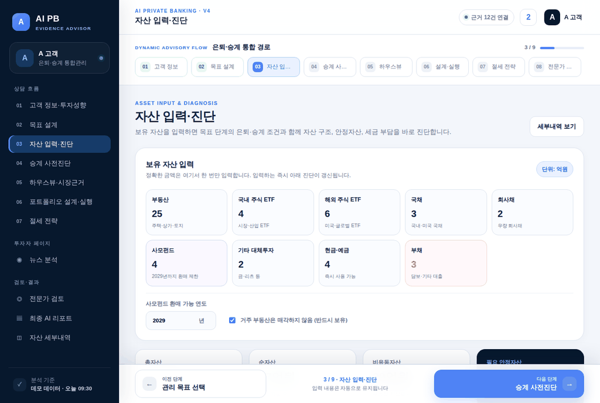

- 부동산, 국내·해외 주식 ETF, 국채, 회사채, 사모펀드, 기타 대체투자, 현금·예금, 부채를 **억원 단위**로 입력합니다.
- 사모펀드는 **환매 가능 연도**를 넣습니다(그 전에는 조정 불가로 처리). 거주 부동산을 팔지 않으려면 체크합니다.
- 아래 **진단 신호**에서 유휴현금, 금융소득 종합과세 기준(연 2,000만원) 초과 여부, 부동산 집중도를 확인합니다.
- **세부내역 보기**를 누르면 자산군별 설명 화면이 나옵니다.

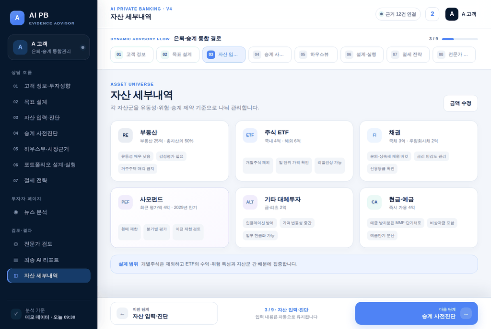

### ④ 승계 사전진단 (승계 목표일 때)

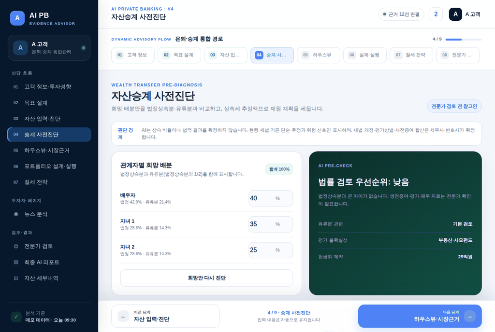

1. 가족별 **희망 배분(%)** 을 입력합니다. 각 줄 아래에 법정상속분·유류분이 함께 보입니다. 합계가 100%여야 다음으로 넘어갑니다.
2. 배분을 입력할 때마다 오른쪽 **법률 검토 우선순위**(낮음·보통·높음)가 바로 바뀝니다. 유류분에 못 미치는 사람이 있으면 "높음"입니다. **희망안 다시 진단** 버튼은 결과를 다시 안내합니다.
3. **상속세 재원**: 추정 상속세와 보험 등 별도 재원을 넣고, 재원 마련 방식 A(금융자산 준비)·B(종신보험 병행)·C(연부연납)를 비교합니다.

### ⑤ 하우스뷰·시장근거

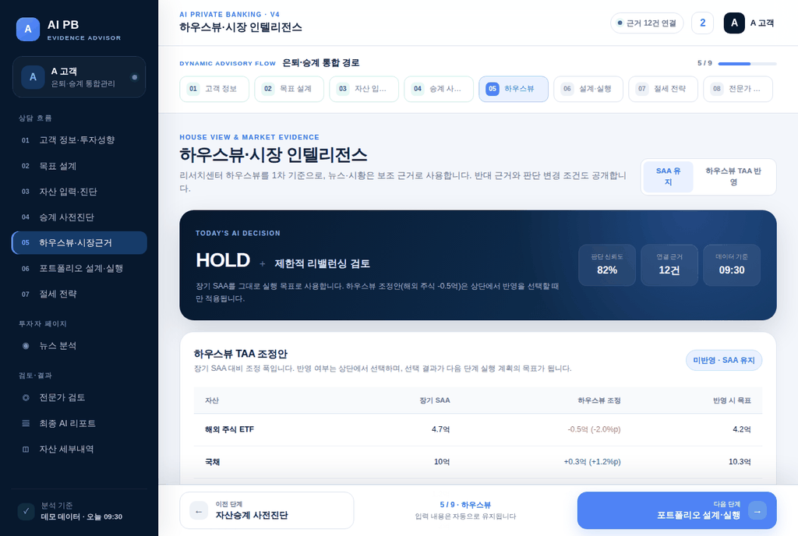

- 증권사 하우스뷰를 자산군별로 확대·중립·축소로 보여줍니다(현재 "데모 예시").
- **SAA 유지 / 하우스뷰 TAA 반영** 중 하나를 고릅니다. TAA를 반영하면 해외 주식 일부가 국채·현금성으로 옮겨집니다.
- 각 판단의 **근거 뉴스·지표, 반대 근거, 판단 변경 조건**을 탭에서 확인합니다.

### ⑥ 포트폴리오 설계·실행

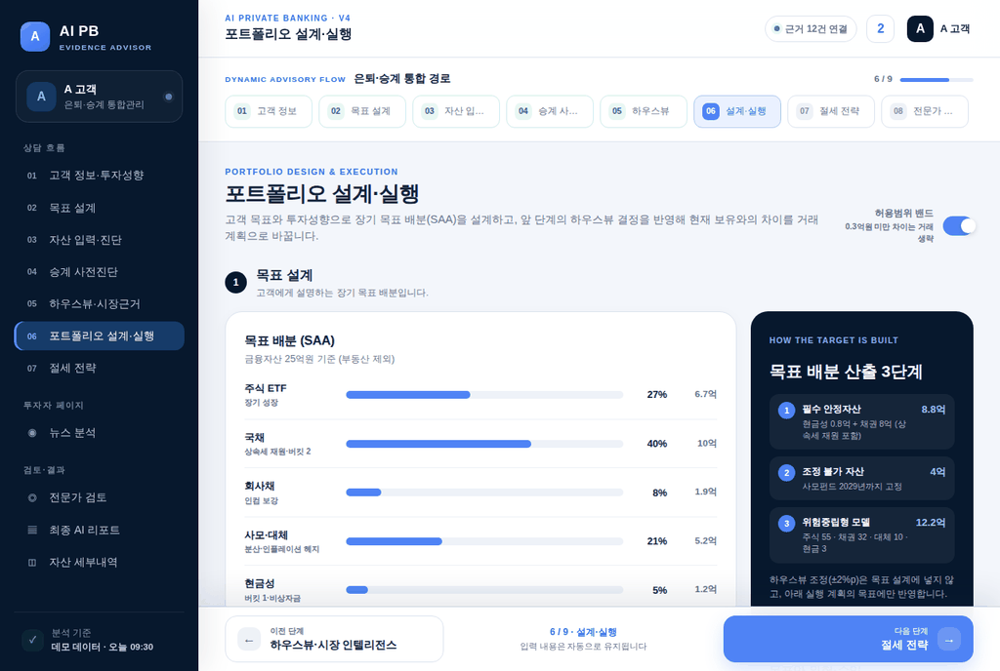

- **목표 배분(SAA)** 과 산출 3단계(필수 안정자산 → 조정 불가 자산 → 성향별 배분)를 확인합니다.
- **허용범위 밴드** 스위치를 켜면 0.3억원 미만 차이는 거래하지 않습니다(거래비용 절감).
- 현재 대비 위험·수익, 분할 실행 순서를 보고 **설계·실행안 검토 완료**를 누릅니다.

### ⑦ 절세 전략

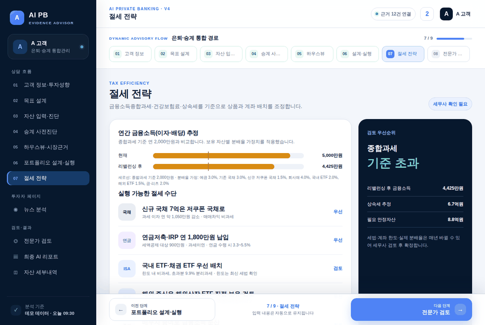

- 현재와 목표안의 **연간 금융소득(이자·배당)** 을 2,000만원 기준선과 비교합니다.
- 저쿠폰 국채, 연금계좌 등 실행 가능한 절세 수단과 우선순위를 봅니다. 최종 판단은 세무사 확인이 필요합니다.

### ⑧ 전문가 검토 (승계 목표일 때)

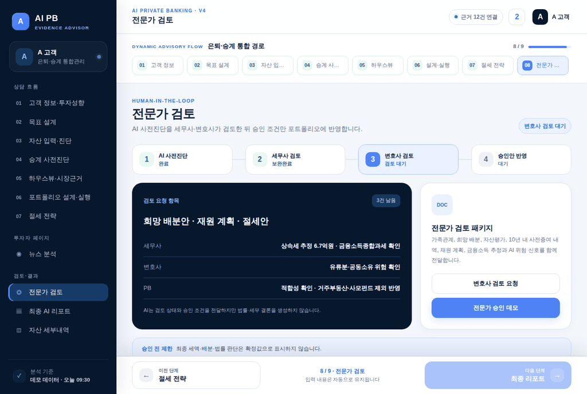

- 희망 배분안·재원 계획·절세안을 **세무사·변호사 검토 패키지**로 정리합니다.
- 현재는 **전문가 승인 데모** 버튼으로 승인 과정을 흉내 냅니다. 승인해야 최종 리포트로 넘어갑니다.
- 승인은 저장되지 않습니다(승인 전후를 섞지 않기 위해). 최종 리포트를 보다가 앱을 닫았으면 다시 열 때 전문가 검토 단계부터 시작합니다.

### ⑨ 최종 AI 자문 리포트

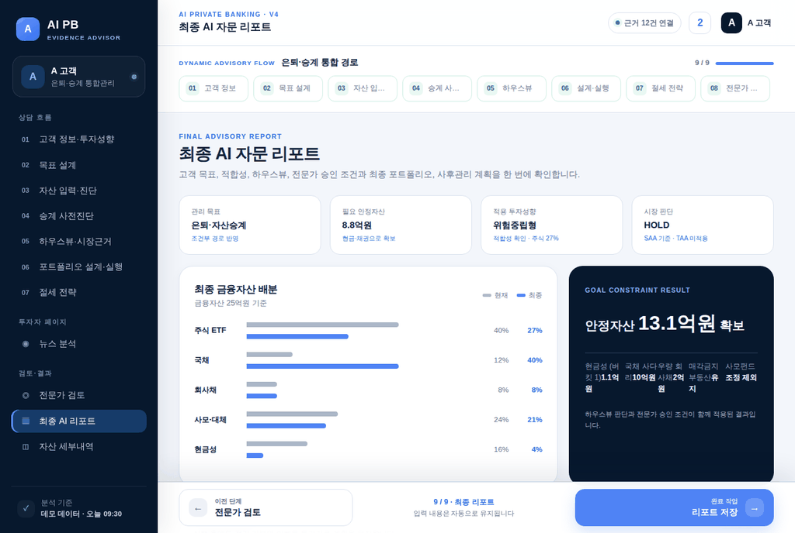

- 목표, 적합성(투자성향), 하우스뷰, 전문가 승인 조건, 최종 배분, 사후관리 계획을 한 화면에 모읍니다.
- **판단 근거 다시 보기**로 하우스뷰·근거 화면으로 돌아갈 수 있습니다.
- 하단 **리포트 저장**을 누르면 인쇄 창이 열립니다. 대상(프린터)을 **PDF로 저장**으로 고르면 `AI-PB-리포트-날짜.pdf`로 저장됩니다(A4, 리포트 화면만). 승계 경로에서 전문가 승인 전이면 머리글에 "전문가 승인 전 초안"이 찍힙니다.
- 휴대폰: Android Chrome은 인쇄 → PDF로 저장. iPhone은 프린트 화면에서 PDF로 저장(기기·버전마다 메뉴 이름이 다를 수 있음).

### 뉴스 분석 (투자자 페이지)

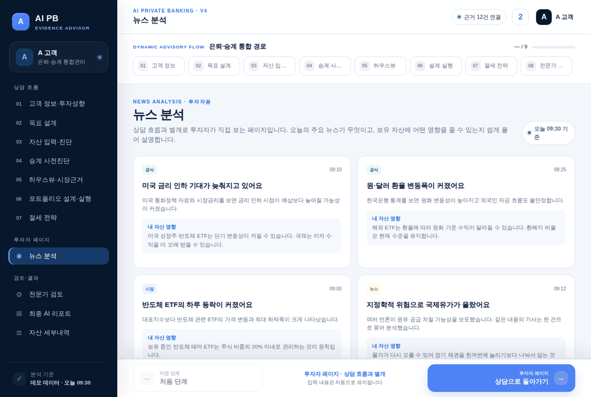

- 왼쪽 메뉴 **뉴스 분석**에서 금리·환율·유가·ETF·반도체·지정학 뉴스를 쉬운 말로 봅니다.
- 지금 화면은 데모 카드 4장입니다. *(시안)* `news-view.js`가 적용되면 카드마다 **확인된 사실 / AI 해석 / 내 자산 영향 / 반대 근거 / 판단 변경 조건**이 붙습니다(AI가 쓴 문장은 "AI 작성" 표시). AI 설명은 중요한 항목부터 매시간 최대 5건씩 채워지므로, 방금 들어온 뉴스는 "AI 설명 준비 중"으로 보일 수 있습니다.
- 뉴스는 GitHub Actions가 매시간 공식·공개 출처(연준, GDELT, 한국은행, FRED)에서 모읍니다. 기사 원문은 저장하지 않고 제목·링크·출처·시각만 보여줍니다.
- **상담으로 돌아가기**로 하던 단계로 돌아갑니다.
- *(시안)* `news-view.js`가 적용되면 `data/news.json`의 최신 항목(최대 12건)이 카드로 바뀌고, 위쪽 **분류 버튼**(전체·금리·환율 등)으로 걸러 볼 수 있습니다. 불러오기에 실패하면 기존 데모 카드가 그대로 보입니다. 화면 하단에는 출처 표기(GDELT·연준·FRED·한국은행)가 붙습니다.

## 5. 저장과 초기화

- 입력하면 0.3초 뒤 **자동 저장**되고 "자동 저장됨 · 시:분"이 표시됩니다. 브라우저를 닫았다 열어도 마지막 단계와 입력값이 그대로입니다.
- 저장 위치는 **이 기기의 이 브라우저**입니다. 다른 기기·다른 브라우저·시크릿 창에서는 이어지지 않습니다.
- 처음부터 하려면 ① 화면의 **처음부터 다시** → 확인.

## 6. 자주 묻는 문제

| 증상 | 해결 |
|---|---|
| 다음 단계 버튼이 안 눌려요 | 안내 문구 확인: 설문 10문항 미응답, 희망 배분 합계 ≠ 100%, 전문가 승인 전 |
| 입력값이 사라졌어요 | 시크릿 창이었거나 브라우저 사이트 데이터를 지웠는지 확인. 다른 브라우저에서는 이어지지 않음 |
| 팀원이 고친 화면이 안 보여요 | 새로고침. 설치한 앱이면 상단 "새로고침" 알림을 누르거나 앱을 껐다 켜기 |
| 오프라인인데 뉴스가 옛날 거예요 | (뉴스 화면이 news.json과 연결된 뒤) 정상입니다. 마지막으로 받은 뉴스를 보여주고, 연결되면 다시 최신으로 바뀝니다 |
| 상속세 숫자가 실제와 달라요 | 일괄공제·배우자공제·금융재산공제·신고세액공제만 반영한 단순 추정입니다. 사전증여·평가 방법은 세무사 확인 |

## 7. 주의 사항

- 모든 화면의 수치·하우스뷰·뉴스는 **데모/교육용**이며 투자 권유가 아닙니다.
- 기대수익·변동성 등 가정값의 출처와 교체안은 `docs/RESEARCH_PARAMETERS.md`, 계산식과 근거는 `docs/FUNCTIONS.md`를 봅니다.
